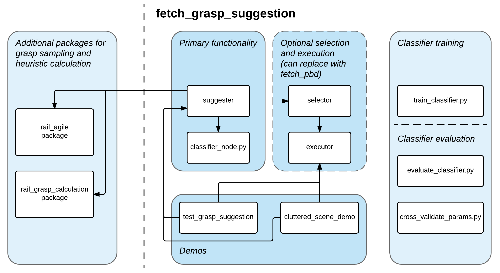

# fetch_grasp_suggestion
Supervised and autonomous grasp suggestion for objects based on their presently observed point cloud geometry.

## Description
This package includes a framework that requests grasps from a grasp sampler that implements the SuggestGrasps action
found in [rail_grasp_calculation_msgs](https://github.com/GT-RAIL/rail_grasp_calculation), ranks them using the
RankGrasps action implemented in [rail_grasp_calculation], and refines the ranking by using a pairwise grasp ranking
formulation.  The package also includes functionality to collect new training examples for the pairwise ranking model,
scripts to retrain the model, and scripts to comprehensively evaluate different pairwise ranking models.  Additionally,
the package includes supporting nodes to run demos and perform physical execution of the suggested grasps on a Fetch
robot.

If you'd like to get the package up and running quickly, follow the [installation instructions](#installation) and one
of the [examples](#example-usage) below that fits your use case.  If you'd like more detailed information about
everything available in this package, we also include [detailed documentation of all functionality](#detailed-node-and-script-documentation)
at the end of this page.

## Menu
* [Installation](#installation)
* [Example Usage](#example-usage)
  * [Grasping individual objects](#grasping-individual-objects)
  * [Clearing a cluttered scene without object segmentation](#clearing-a-cluttered-scene-without-object-segmentation)
  * [Collecting new grasp preference training data](#collecting-new-grasp-preference-training-data)
  * [Training a new classifier](#training-a-new-classifier)
  * [Evaluating alternative classifiers](#evaluating-alternative-classifiers)
  * [Connecting alternative object segmentation](#connecting-alternative-object-segmentation)
* [Detailed node and script documentation](#detailed-node-and-script-documentation)
  * [Primary ROS nodes](#primary-ros-nodes)
  * [Supporting ROS nodes](#supporting-ros-nodes)
  * [Demo ROS nodes](#demo-ros-nodes)
  * [Classifier training and evaluation scripts](#classifier-training-and-evaluation-scripts)

## Installation
This package requires [scikit-learn](http://scikit-learn.org/stable/index.html).  Installation instructions can be found
[here](http://scikit-learn.org/stable/install.html).

There are a few other dependencies for generating plots to evaluate classifiers.  They can be installed with the
following:
```bash
sudo apt-get install python-matplotlib
pip install treeinterpreter
```

Install the package by cloning the `fetch_grasp_suggestion` repository into your catkin workspace and building it as follows:
```bash
cd (your catkin workspace)/src
git clone https://github.com/fetchrobotics/fetch_grasp_suggestion.git
cd ..
catkin_make
```

This package is designed to work with [rail_grasp_calculation](https://github.com/GT-RAIL/rail_grasp_calculation) and
[rail_agile](https://github.com/GT-RAIL/rail_agile).  These packages can be installed with instructions provided
[here](https://github.com/GT-RAIL/rail_grasp_calculation)

## Example Usage
The following sections will function as short tutorials to get the system up and running for specific use cases.

### Grasping individual objects
The primary purpose of this package is to facilitate object grasping.  The package includes a demo file to
immediately show off this functionality, and it's also designed to be incorporated into larger systems that require
pick-and-place.  Both methods are explained below.

**Grasping Demo**
1. Launch the grasping demo:
   1. Identify the topic of the point cloud you want to use as input.  This will be referred to as CLOUD for the
   rest of these instructions.  If you're using the Fetch's head camera, you can skip this step as it will be set by
   default.
   1. Identify the name of the file name and path of the classifier model you're using.  This will be referred to as
   CLASSIFIER for the rest of these instructions.  If you haven't trained your own classifier, you can skip this
   step and use the default pre-trained classifier.
   1. Run MoveIt! on the fetch with: `roslaunch fetch_moveit_config move_group.launch allow_active_sensing:=true`
   1. Launch the grasping demo with: `roslaunch fetch_grasp_suggestion grasp_suggestion_testing.launch
   cloud_topic:=CLOUD classifier_file:=CLASSIFIER`, setting parameters only if you don't want to use the Fetch head
   camera and the pre-trained classifier.
1. Run the rviz interface with: `roslaunch fetch_grasp_suggestion grasp_suggestion_testing_frontend.launch`
1. Call the segmentation service to update the scene objects.
   * This demo starts [rail_segmentation](http://wiki.ros.org/rail_segmentation) by default.  You can call the
   segmenter from the command line with `rosservice call rail_segmentation/segment {}`
   * If you'd like to use different object segmentation, see
   [alternative segmentation](#connecting-alternative-object-segmentation) below.
1. Call grasp suggestion by publishing to an object index to the `test_grasp_suggestion/grasp_object` topic.  For
example, to grasp segmented object 0 from the command line, use: `rostopic pub /test_grasp_suggestion/grasp_object
std_msgs/Int32 "data: 0"`
   * To use methods other than pairwise ranking (note, these generally don't perform as well and were only included for
   evaluation), just change the topic you're publishing to:
     * For grasps ranked by heuristics only: `rostopic pub /test_grasp_suggestion/grasp_object_heuristic std_msgs/Int32
     "data: 0"`
     * For grasps from the AGILE pipeline: `rostopic pub /test_grasp_suggestion/grasp_object_agile std_msgs/Int32
     "data: 0"`
     * For a random antipodal grasp: `rostopic pub /test_grasp_suggestion/grasp_object_random std_msgs/Int32
     "data: 0"`
1. Executing the final grasp will require user input for safety.  Follow the instructions on the command line to execute
the grasp.

**Integrating Object Grasp Suggestion into a Larger System**
1. Start grasp suggestion:
   1. Identify the topic of the point cloud you want to use as input.  This will be referred to as CLOUD for the
   rest of these instructions.  If you're using the Fetch's head camera, you can skip this step as it will be set by
   default.
   1. Identify the name of the file name and path of the classifier model you're using.  This will be referred to as
   CLASSIFIER for the rest of these instructions.  If you haven't trained your own classifier, you can skip this
   step and use the default pre-trained classifier.
   1. Launch grasp suggestion with: `roslaunch fetch_grasp_suggestion grasp_suggestion.launch cloud_topic:=CLOUD
   classifier_file:=CLASSIFIER`, setting parameters only if you don't want to use the Fetch head camera and the
   pre-trained classifier.
1. To calculate grasp suggestions, have your node connect to the `suggester/suggest_grasps` ROS server
   1. Pass in a segmented object point cloud as the service request.
   2. The response will be a ranked grasp list, with the best grasp first.

### Clearing a cluttered scene without object segmentation
A secondary use of this package is to calculate grasps over scenes without object segmentation.  For example, if you
want to clear objects from a cluttered scene and you don't have object segmentation that can reliably identify objects
in clutter, you can use this package to generate grasps over an entire scene, rather than for specific objects.  This
package includes a demo file that performs cluttered scene clearing, and we also include instructions on integrating
this functionality into a larger system.  Both methods are explained below.

**Cluttered Scene Clearing Demo**
1. Launch the cluttered scene demo:
   1. Identify the topic of the point cloud you want to use as input.  This will be referred to as CLOUD for the
   rest of these instructions.  If you're using the Fetch's head camera, you can skip this step as it will be set by
   default.
   1. Identify the name of the file name and path of the classifier model you're using.  This will be referred to as
   CLASSIFIER for the rest of these instructions.  If you haven't trained your own classifier, you can skip this
   step and use the default pre-trained classifier.
   1. Run MoveIt! on the fetch with: `roslaunch fetch_moveit_config move_group.launch allow_active_sensing:=true`
   1. Launch the cluttered scene demo with: `roslaunch fetch_grasp_suggestion cluttered_scene_demo.launch
   cloud_topic:=CLOUD classifier_file:=CLASSIFIER`, setting parameters only if you don't want to use the Fetch head
   camera and the pre-trained classifier.
1. Run the rviz interface with: `roslaunch fetch_grasp_suggestion cluttered_scene_demo_frontend.launch`
1. Start the demo by publishing an empty message to the `cluttered_scene_demo/run_demo` topic.  For example, to start
the demo from the command line, use: `rostopic pub /cluttered_scene_demo/run_demo std_msgs/Empty "{}"`
   * Executing each grasp will require user input for safety.  Follow the instructions on the command line to execute
   whenever the demo pauses before grasp execution.
   * The demo will loop until it can't find anymore grasps in the scene.  It can be stopped earlier by following
   instructions to quit provided in the command line during each pause before grasp execution.

**Integrating Scene Grasp Suggestion into a Larger System**
1. Start grasp suggestion:
   1. Identify the topic of the point cloud you want to use as input.  This will be referred to as CLOUD for the
   rest of these instructions.  If you're using the Fetch's head camera, you can skip this step as it will be set by
   default.
   1. Identify the name of the file name and path of the classifier model you're using.  This will be referred to as
   CLASSIFIER for the rest of these instructions.  If you haven't trained your own classifier, you can skip this
   step and use the default pre-trained classifier.
   1. Launch grasp suggestion with: `roslaunch fetch_grasp_suggestion grasp_suggestion.launch cloud_topic:=CLOUD
   classifier_file:=CLASSIFIER`, setting parameters only if you don't want to use the Fetch head camera and the
   pre-trained classifier.
1. To calculate grasp suggestions over a scene, have your node connect to the `suggester/suggest_grasps_scene` ROS
server
   1. Pass in a point cloud of the complete scene as the service request.
   2. The response will be a ranked grasp list, with the best grasp first.

### Collecting new grasp preference training data
To collect new grasp preferences, we recommend using the new version of
[fetch_pbd](https://github.com/fetchrobotics/fetch_pbd).  This package also includes an older pipeline for gathering
grasp suggestions using an interactive marker server and the command line.  WARNING: This functionality is deprecated
in favor of fetch_pbd, but we include instructions here for completeness.

1. Launch the grasp suggestion collector:
   1. Run MoveIt! on the fetch with: `roslaunch fetch_moveit_config move_group.launch allow_active_sensing:=true`
   1. Launch the grasp suggestion collector with: `roslaunch fetch_grasp_suggestion grasp_suggestion_collector.launch`
1. Run the rviz interface with: `roslaunch fetch_grasp_suggestion grasp_suggestion_collector_frontend.launch`
1. Call the segmentation service to update the scene objects.
   * This pipeline starts [rail_segmentation](http://wiki.ros.org/rail_segmentation) by default.  You can call the
   segmenter from the command line with `rosservice call rail_segmentation/segment {}`
1. Generate grasps for an object by sending an object index to the `suggester/get_grasp_suggestions` action server.
1. Cycle through the grasp suggestions, visualized in RVIZ with a marker representing the Fetch's gripper, by calling
the `selector/cycle_grasps` ROS service.
1. Select the best grasp and execute it by sending an empty goal to the `selector/execute_selected_grasp` action server.
   * This will append new pairwise feature vectors as training data to the `grasp_data.csv` file, which will be
   located in the `.ros` directory under your home directory.
   * The final .csv file can optionally be added to the `data/grasp_preferences` directory of `fetch_grasp_suggestion`
   to use relative paths for other launch files.

### Training a new classifier
If you have training data in a .csv file, training a new classifier is as easy as running a single script.  The trained
classifier can then be used by changing the `classifier_file` parameter in many of the launch files.  New trained
classifiers can be added to the `data/classifier/` directory of `fetch_grasp_suggestion`, or they can be loaded from
anywhere by passing an absolute path to the `classifier_file` parameter.

1. Decide what types of classifier you'd like to train.  Supported classifier types include: `["decision_tree",
"random_forest", "ada_boost", "knn", "svm", "logistic_regression", "nn1", "nn2"]`.  This will be referred to as
CLASSIFIERS for the rest of these instructions.
1. Identify the file name and path of your training data, which will be referred to as DATA for the rest of these
instructions.
1. Call the classifier training node with: `rosrun fetch_grasp_suggestion train_classifier.py
_classifier_types:=CLASSIFIERS _file_name:=DATA`

Examples:
* Train a random forest and a k nearest neighbors model over training data `new_grasp_data.csv` found in
the `(fetch_grasp_suggestion)/data/grasp_preferences` directory:
```bash
rosrun fetch_grasp_suggestion train_classifier.py _classifier_types:=random_forest,knn _file_name:=new_grasp_data.csv
```
* Train a neural network with 2 hidden layers over training data `lots_of_data.csv` found in your home directory:
```bash
rosrun fetch_grasp_suggestion train_classifier.py _classifier_types:=nn2 _file_name:=/home/(username)/lots_of_data.csv
```

### Evaluating alternative classifiers
This package contains many tools for evaluating different classifier types and different model parameters.  For model
parameter cross validation, call `rosrun fetch_grasp_suggestion cross_validate_params.py` with parameters as specified
in [its detailed documentation section](#cross_validate_params.py).  For comparing the effectiveness of different types
of classifiers, call `rosrun fetch_grasp_suggestion evaluate_classifier.py` with parameters as specified in
[its detailed documentation section](#evaluate_classifier.py).

### Connecting alternative object segmentation
By default, this package is set up to use [rail_segmentation](http://wiki.ros.org/rail_segmentation) for object
segmentation.  If you'd like to use your own segmentation methodology, this can easily be connected to
`fetch_grasp_suggestion` with the following steps.

1. Make sure your segmentation implementation publishes segmented objects to a topic with message type
[rail_segmentation/SegmentedObjectList](https://github.com/GT-RAIL/rail_manipulation_msgs/blob/master/msg/SegmentedObjectList.msg).
1. Change the `fetch_grasp_suggestion` launch file you're using to start up your segmentation instead of
`rail_segmentation`
1. Set the `segmentation_topic` parameter of any `fetch_grasp_suggestion` nodes that you're running to your new
segmentation topic.

## Detailed node and script documentation
The package contains a set of ROS nodes organized as shown in the diagram below.  Each section is documented separately
in the following subsections.


### Primary ROS nodes
The following nodes handle the core functionality of this package, including grasp suggestion and pairwise
classification.

#### suggester
This node interfaces with grasp sampling and ranking to get a set of grasp poses with heuristics, then uses this
information to re-rank the grasps by calling the pairwise ranking model on every grasp pair.  This node also receives
feedback on grasps selected by human operators to create new training examples for the pairwise ranking model.  Relevant
topics, services, action clients, and action servers, and parameters are as follows:
* **Subscribers**
  * `/head_camera/depth_registered/points`([pcl/PointCloud<pcl/PointXYZRGB>](http://wiki.ros.org/pcl_ros))
  Point cloud stream of the entire environment, used for updating the scene context
  for grasp suggestion.  The point cloud subscribed to can be changed by setting the `cloud_topic` param.
  * `~/grasp_feedback`([rail_manipulation_msgs/GraspFeedback](https://github.com/GT-RAIL/rail_manipulation_msgs/blob/master/msg/GraspFeedback.msg))
  Feedback for grasp selection.  Publish to this topic when the user selects a grasp
  to generate new training data for the pairwise ranking model.
  * `/rail_segmentation/segmented_objects`([rail_manipulation_msgs/SegmentedObjectList](https://github.com/GT-RAIL/rail_manipulation_msgs/blob/master/msg/SegmentedObjectList.msg))
  (DEPRECATED) Incoming segmented objects, for use with the action server
  grasp suggestion pipeline.  The topic can be changed to any other source of segmented objects by setting the
  `segmentation_topic` param.  This has been deprecated in favor of the service grasp suggestion pipeline, which is
  recommended instead.
* **Publishers**
  * `~/grasps`([fetch_grasp_suggestion/RankedGraspList](https://github.com/GT-RAIL/fetch_grasp_suggestion/blob/melodic-devel/msg/RankedGraspList.msg))
  (DEPRECATED) Topic for publishing grasps after performing grasp suggestion with
  the action server pipeline.  This has been deprecated in favor of the service grasp suggestion pipeline, which is
  recommended instead.
* **Service Clients**
  * `/executor/clear_objects`([std_srvs/Empty](http://docs.ros.org/api/std_srvs/html/srv/Empty.html))
  Clear collision objects from the scene.  Supports the (optional) grasp executor
  node included in this package.
  * `/executor/add_object`([fetch_grasp_suggestion/AddObject](https://github.com/GT-RAIL/fetch_grasp_suggestion/blob/melodic-devel/srv/AddObject.srv))
  Add a collision object to the scene.  Supports the (optional) grasp executor node
  included in this package.
  * `/classify_all`([fetch_grasp_suggestion/ClassifyAll](https://github.com/GT-RAIL/fetch_grasp_suggestion/blob/melodic-devel/srv/ClassifyAll.srv))
  Perform pairwise classification for all pairs of grasps.  Connects to the
  classifier node included in this package.
* **Service Servers**
  * `~/suggest_grasps`([rail_manipulation_msgs/SuggestGrasps](https://github.com/GT-RAIL/rail_manipulation_msgs/blob/master/srv/SuggestGrasps.srv))
  Given an object point cloud, sample grasps and get an initial ranking for them by
  calculating grasp heuristics.
  * `~/suggest_grasps_scene`([rail_manipulation_msgs/SuggestGrasps](https://github.com/GT-RAIL/rail_manipulation_msgs/blob/master/srv/SuggestGrasps.srv))
  Given a scene point cloud, sample grasps and get an initial ranking for them by
  calculating grasp heuristics.
  * `~/suggest_grasps_baseline`([rail_manipulation_msgs/SuggestGrasps](https://github.com/GT-RAIL/rail_manipulation_msgs/blob/master/srv/SuggestGrasps.srv))
  Given a point cloud, sample grasps classified as antipodal using the full AGILE
  pipeline.  This is only included for evaluation purposes, as the suggest_grasps or suggest_grasps_scene servers
  produce better results.
  * `~/suggest_grasps_random`([rail_manipulation_msgs/SuggestGrasps](https://github.com/GT-RAIL/rail_manipulation_msgs/blob/master/srv/SuggestGrasps.srv))
  Given an object point cloud, sample antipodal grasps with a random ordering.  This
  is included only for baseline testing, and should not be used for any real applications!
  * `~/pairwise_rank`([rail_manipulation_msgs/PairwiseRank](https://github.com/GT-RAIL/rail_manipulation_msgs/blob/master/srv/PairwiseRank.srv))
  Re-rank the most recently computed grasp list for an object using the pairwise
  ranking model.
  * `~/pairwise_rank_scene`([rail_manipulation_msgs/PairwiseRank](https://github.com/GT-RAIL/rail_manipulation_msgs/blob/master/srv/PairwiseRank.srv))
  Re-rank the most recently computed grasp list for a scene using the pairwise
  ranking model.
* **Action Clients**
  * `/rail_agile/sample_grasps`([rail_grasp_calculation_msgs/SampleGraspsAction](https://github.com/GT-RAIL/rail_grasp_calculation/blob/master/rail_grasp_calculation_msgs/action/SampleGrasps.action))
  Antipodal grasp sampler using AGILE.  If you'd like to change the source for the
  initial sampled grasps, you can remap this topic to any other grasp sampling action server that implements the
  rail_grasp_calculation_msgs SampleGraspsAction.
  * `/rail_agile/sample_classify_grasps`([rail_grasp_calculation_msgs/SampleGraspsAction](https://github.com/GT-RAIL/rail_grasp_calculation/blob/master/rail_grasp_calculation_msgs/action/SampleGrasps.action))
  Full AGILE grasp sampling pipeline.  Only required for the
  `~/suggest_grasps_baseline` service.
  * `/grasp_sampler/rank_grasps_object`([rail_grasp_calculation_msgs/RankGraspsAction](https://github.com/GT-RAIL/rail_grasp_calculation/blob/master/rail_grasp_calculation_msgs/action/RankGrasps.action))
  Calculate heuristics and rank grasps for an object using rail_grasp_calculation.
  * `/grasp_sampler/rank_grasps_scene`([rail_grasp_calculation_msgs/RankGraspsAction](https://github.com/GT-RAIL/rail_grasp_calculation/blob/master/rail_grasp_calculation_msgs/action/RankGrasps.action))
  Calculate heuristics and rank grasps for a scene using rail_grasp_calculation.
* **Action Servers**
  * `~/get_grasp_suggestions`([fetch_grasp_suggestion/SuggestGraspsAction](https://github.com/GT-RAIL/fetch_grasp_suggestion/blob/melodic-devel/action/SuggestGrasps.action))
  (DEPRECATED) Sample grasps and calculate an initial ranking based on grasp
  heuristics by action server.  This is deprecated in favor of the service implementation `~/suggest_grasps`, which is
  recommended instead.
* **Parameters**
  * `segmentation_topic`(string, "rail_segmentation/segmented_objects")
  Topic for incoming segmented object data.
  * `cloud_topic`(string, "head_camera/depth_registered/points")
  Point cloud topic to update the scene where grasping is taking place.
  * `file_name`(string, "grasp_data")
  Name of a csv text file to save new training data to.
  * `min_grasp_depth`(double, -0.03)
  Minimum depth offset (in m) to adjust a suggested grasp by for execution.
  * `max_grasp_depth`(double, 0.03)
  Maximum depth offset (in m) to adjust a suggested grasp by for execution.

#### classifier_node.py
This node implements the pairwise ranking model and exposes it as a service.
* **Service Servers**
  * `~/classify_grasp_pair`([fetch_grasp_suggestion/ClassifyGraspPair](https://github.com/GT-RAIL/fetch_grasp_suggestion/blob/melodic-devel/srv/ClassifyGraspPair.srv))
  Perform a single classification for a pair of grasps.  If you're classifying more
  than one grasp, use the `~/classify_all` service instead, as it is very slow to re-instantiate the model for every
  classification instance.
  * `~/classify_all`([fetch_grasp_suggestion/ClassifyAll](https://github.com/GT-RAIL/fetch_grasp_suggestion/blob/melodic-devel/srv/ClassifyAll.srv))
  Perform pairwise classification on all pairs of grasps, returning a re-ordered
  grasp list as a result.
* **Parameters**
  * `~/file_name`(string, "decision_tree.pkl")
  Filename for an already-trained classifier model.  We include a pre-trained
  random forest model, and you can generate new models using the `train_classifier.py` script.  Filenames can be
  relative to the package path or absolute.
  * `~/n_jobs`(int, 1)  For classifiers that support this parameter, the number of jobs to use when performing
  classification.  Passing in -1 will use as much processing as is available.
  &nbsp;&nbsp;&nbsp;&nbsp;&nbsp;&nbsp;
  * `~/interpret_trees`(bool, false)
  Flag for generating a plot detailing the contributions of each feature over a set of classifications, only valid for
  decision tree and random forest classifiers.  NOTE: This is buggy, in that it tends to crash after generating plots
  repeatedly, so leave this off unless you specifically want plots to be generated.
  * `~/object_feature_size`(int, 6)
  The length of the feature vector describing only the object (not the difference)
  of grasp heuristics).

### Supporting ROS nodes
The following nodes are optional nodes that can be used to execute the suggested grasps, or to select grasps using an
interactive marker server implementation for grasp execution and generation of new training examples.

#### executor
An optional standalone grasp executor for the Fetch robot.  Relevant services and actions are as follows:
* **Action Servers**
  * `~/execute_grasp`([fetch_grasp_suggestion/ExecuteGraspAction](https://github.com/GT-RAIL/fetch_grasp_suggestion/blob/melodic-devel/action/ExecuteGrasp.action))
  Execute a grasp pose, which involves moving to the approach angle, opening the gripper, moving in a straight-line
  trajectory to the grasp pose, closing the gripper, and lifting the object.
  * `~/prepare_robot`([fetch_grasp_suggestion/PresetMoveAction](https://github.com/GT-RAIL/fetch_grasp_suggestion/blob/melodic-devel/action/PresetMove.action))
  Move the arm to a "ready to grasp" pose that's out of the way of the camera.
  * `~/drop_position`([fetch_grasp_suggestion/PresetMoveAction](https://github.com/GT-RAIL/fetch_grasp_suggestion/blob/melodic-devel/action/PresetMove.action))
  Move the arm to a predefined position to drop an object.
  * `~/preset_position`([fetch_grasp_suggestion/PresetMoveAction](https://github.com/GT-RAIL/fetch_grasp_suggestion/blob/melodic-devel/action/PresetJointsMove.action))
  Move the arm to a preset position that is defined in the message. The message is a subset of [sensor_msgs/JointState](http://docs.ros.org/indigo/api/sensor_msgs/html/msg/JointState.html) alongwith a velocity scaling factor.
* **Service Servers**
  * `~/add_object`([fetch_grasp_suggestion/AddObject](https://github.com/GT-RAIL/fetch_grasp_suggestion/blob/melodic-devel/srv/AddObject.srv))
  Add an object to the MoveIt! collision scene.
  * `~/clear_objects`([std_srvs/Empty](http://docs.ros.org/api/std_srvs/html/srv/Empty.html))
  Remove all collision objects from the MoveIt! collision scene.
  * `~/detach_objects`([std_srvs/Empty](http://docs.ros.org/api/std_srvs/html/srv/Empty.html))
  Detach any collision objects currently attached to the gripper.
  * `~/drop_object`([std_srvs/Empty](http://docs.ros.org/api/std_srvs/html/srv/Empty.html))
  Open the gripper and remove all collision objects.


#### selector
(DEPRECATED) An optional interactive marker server used for collecting new training examples.  This is deprecated in
favor of a better interface implementation in fetch_pbd, which is recommended instead.
* **Subscribers**
  * `/suggester/grasps`([fetch_grasp_suggestion/RankedGraspList](https://github.com/GT-RAIL/fetch_grasp_suggestion/blob/melodic-devel/msg/RankedGraspList.msg))
  Subscriber for newly calculated and ranked grasps, coming from the `suggester`
  node by default.  The topic can be changed by setting the `grasps_topic` parameter.
  * `/rail_segmentation/segmented_objects`([rail_manipulation_msgs/SegmentedObjectList](https://github.com/GT-RAIL/rail_manipulation_msgs/blob/master/msg/SegmentedObjectList.msg))
  Segmented objects subscriber.  Object information is used when generating new
  training examples.  This topic can be changed by setting the `segmentation_topic` parameter.
* **Service Servers**
  * `~/cycle_grasps`([fetch_grasp_suggestion/CycleGrasps](https://github.com/GT-RAIL/fetch_grasp_suggestion/blob/melodic-devel/srv/CycleGrasps.srv))
  Advance the currently displayed grasp forward or backward.
* **Action Clients**
  * `/executor/execute_grasp`([fetch_grasp_suggestion/ExecuteGraspAction](https://github.com/GT-RAIL/fetch_grasp_suggestion/blob/melodic-devel/action/ExecuteGrasp.action))
  Connection to the standalone grasp `executor` included in this package.
* **Action Servers**
  * `~/execute_selected_grasp`([fetch_grasp_suggestion/ExecuteSelectedGraspAction](https://github.com/GT-RAIL/fetch_grasp_suggestion/blob/melodic-devel/action/ExecuteSelectedGraspAction.action))
  Execute the currently selected grasp and create new pairwise training examples
  based on the grasp executed and the grasps seen by the user.
* **Parameters**
  * `~/segmentation_topic`(string, "rail_sgementation/segmented_objects")
  Topic for subscribing to segmented objects.
  * `~/grasps_topic`(string, "suggester/grasps")
  Topic for subscribing to new calculated grasps
  * `~/file_name`(string, "grasp_data")
  Filename of a .csv text file to save new training data to.

### Demo ROS nodes
The nodes in this section will run the full pipeline of processing a point cloud, sampling grasps for an object or
scene, calculate heuristics for those grasps, rank the grasp list with pairwise ranking, and execute the best grasp.
None of the nodes have a GUI (sorry!), but they can be called from the command line by simply publishing to the
appropriate ROS topic.  Further, before grasps are executed, the user has the option to view them first and must
provide keyboard input to actually execute the grasp for safety reasons.

#### test_grasp_suggestion
Test individual object grasping with a variety of different strategies, including our novel pairwise ranking method,
ranking based only on our heuristics, the full AGILE pipeline, and a baseline random grasp from antipodal candidates.
Each method is called by publishing a [std_msgs/Int32](http://docs.ros.org/api/std_msgs/html/msg/Int32.html) message
with the index of the object to be grasped to the appropriate test topic.  Relevant topics and parameters are as
follows:
* **Subscribers**
  * `~/grasp_object`([std_msgs/Int32](http://docs.ros.org/api/std_msgs/html/msg/Int32.html))
  Grasp an object using the pairwise ranking method.
  * `~/grasp_object_heuristic`([std_msgs/Int32](http://docs.ros.org/api/std_msgs/html/msg/Int32.html))
  Grasp an object using ranks derived directly from the heuristics.
  * `~/grasp_object_agile`([std_msgs/Int32](http://docs.ros.org/api/std_msgs/html/msg/Int32.html))
  Grasp an object using the full AGILE pipeline.
  * `~/grasp_object_random`([std_msgs/Int32](http://docs.ros.org/api/std_msgs/html/msg/Int32.html))
  Grasp an object using a random antipodal grasp.
* **Publishers**
  * `~/debug`([geometry_msgs/PoseStamped](http://docs.ros.org/api/geometry_msgs/html/msg/PoseStamped.html))
  Grasp pose to be executed.  It's recommended to display this topic in rviz when
  monitoring grasp execution.
* **Parameters**
  * `~/segmentation_topic`(string, "rail_sgementation/segmented_objects")
  Topic for subscribing to segmented objects.
  * `~/debug`(bool, true)
  Publish the pose to be executed if true.

#### cluttered_scene_demo
Run a demo where the robot will continue to calculate and perform grasps until a surface in front of it is empty.  It
will loop through execution cycles that consist of moving the arm out of the way of the camera, taking a point cloud
snapshot, sampling and ranking grasps over the point cloud snapshot, executing the best grasp, moving to a drop
position off to the side of the robot, and dropping the object.  Starting the demo requires publishing an empty
message to a topic after the node is running.  Relevant topics and parameters are as follows:
* **Subscribers**
  * `~/run_demo`([std_msgs/Empty](http://docs.ros.org/indigo/api/std_msgs/html/msg/Empty.html))
  Execute the demo.  As with `test_grasp_suggestion`, each grasp will still require keyboard input before execution,
  for safety.
* **Parameters**
  * `~/cloud_topic`(string, "head_camera/depth_registered/points")
  Topic of the point cloud that includes the scene to be cleared.

### Classifier training and evaluation scripts
The following python scripts facilitate training and evaluating new classifiers.  Each script is implemented as a ROS
node, and can be run with rosrun to set parameters.

#### train_classifier.py
This is the main script for training a new classifier and saving the model.  Newly trained classifiers will be saved
in the current directory of the terminal in which the script was executed.
* **Parameters**
  * `~/classifier_types` (string[], ["decision_tree"])
  The types of classifiers to train models for.  Supported classifiers include: `["decision_tree", "random_forest",
  "ada_boost", "knn", "svm", "logistic_regression", "nn1", "nn2"]`, where `"nn1"` is a neural network with a single
  hidden layer, and `"nn2"` is a neural network with two hidden layers.  You can also pass in "all" to train one of
  each supported classifier.
  * `~/file_name` (string, "grasp_data.csv")
  The filename containing the training data.  File paths can be relative or absolute.  If the path is relative, the
  script assumes the file is located in the directory (location of fetch_grasp_suggestion)/data/grasp_preferences/.

#### evaluate_classifier.py
Compare the performance of different types of classifiers with various tests and metrics, including k-folds cross
validation, detailed results on a train/test split, learning curve plots, ROC curves, and precision-recall curves.
* **Parameters**
  * `~/classifier_types` (string[], ["decision_tree"])
  The types of classifiers to test.  Supported classifiers include: `["decision_tree", "random_forest",
  "ada_boost", "knn", "svm", "logistic_regression", "nn1", "nn2"]`, where `"nn1"` is a neural network with a single
  hidden layer, and `"nn2"` is a neural network with two hidden layers.  You can also pass in "all" to evaluate
  every supported classifier.
  * `~/file_name` (string, "grasp_data.csv")
  The filename containing all of the data, which will be used to create training and testing sets.  File paths can be
  relative or absolute.  If the path is relative, the script assumes the file is located in the directory (location of
  fetch_grasp_suggestion)/data/grasp_preferences/.
  * `~/split` (double, 0.4)
  Ratio used to split the data into a train and test set.  The value corresponds to the fraction of the total data to be
  used for the test set.
  * `~/generate_plots` (bool, false)
  Flag for generating plots.  If true, the script will generate training curves, ROC curves, and precision-recall curves
  for each classifier specified in `classifier_types`.  Otherwise, the script will only provide the accuracy from
  cross validation and the detailed classification report over the train/test split in the terminal.

#### cross_validate_params.py
Perform cross validation to examine the effects of different model parameters for a given classifier type.
* **Parameters**
  * `~/classifier_types` (string[], ["decision_tree"])
  The types of classifiers to use.  A separate cross-validation procedure will be carried out for each classifier type,
  with a set of parameters appropriate to that classifier type.  Supported classifiers include: `["decision_tree",
  "random_forest", "ada_boost", "knn", "svm", "logistic_regression", "nn1", "nn2"]`, where `"nn1"` is a neural network
  with a single hidden layer, and `"nn2"` is a neural network with two hidden layers.  You can also pass in "all" to
  cross validate parameters for every supported classifier.
  * `~/file_name` (string, "grasp_data.csv")
  The filename containing all of the data, which will be used for training and testing during cross-validation.  File
  paths can be relative or absolute.  If the path is relative, the script assumes the file is located in the directory
  (location of fetch_grasp_suggestion)/data/grasp_preferences/.
  * `~/generate_plots` (bool, false)
  Flag for generating plots that show the effects of different parameter values on classification rate.  If true, one
  plot will be generated for each classifier type specified in `classifier_types`.  If false, the results will be
  reported only by text output in the terminal.  Generating plots is recommended for getting a better understanding of
  the parameter effects.
