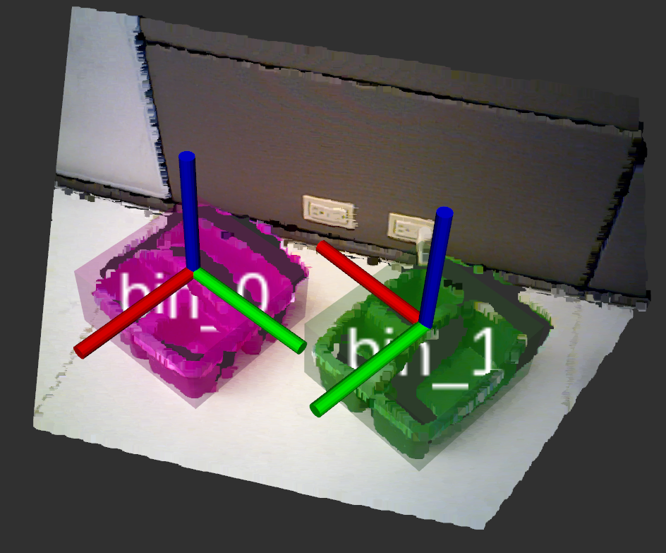
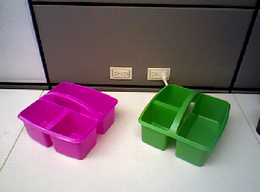
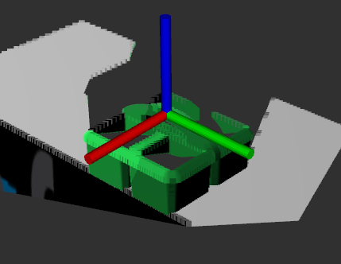
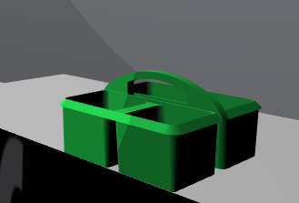

# FetchIt Challenge Bin Pose Detection Pipeline

This repository contains the pipeline to detect bin poses.

## Install
0. Verify that the GNU Scientific Library (i.e. libgsl-dev on apt) and ApproxMVBB library  (i.e. 
asr_approx_mvbb in ros) are installed, which should be part of the `active`/`stable` dual workspace 
model for the `derail-fetchit` repo.
1. Verify that `fetchit_bin_detector` is part of the `derail-fetchit` repo inside the `src` folder 
of your `active` workspace.
2. Use `catkin build` to compile the `fetchit_bin_detector` into executables.
3. Source your `devel/setup.bash` file in the `active` workspace.

## Launch Bin Detector Demo
0. Connect the robot or camera to the desktop being used.
1. If you are running with the real or simulated robot, set the `robot` parameter in the 
`detector_demo.launch` file to `true`. If you are running with only an Asus camera, set the `robot` 
parameter in the `detector_demo.launch` file to `false` (this will startup camera drivers needed to 
receive pointclouds from the camera).
2. Start the demo by running `roslaunch fetchit_bin_detector detector_demo.launch`. This should 
launch the bin detector along with `rail_segmentation` automatically.
3. Run `rosservice call /detect_bins` to detect the bins in the current camera frame. This should 
display a coordinate frame centered on the bins and return the `geometry_msgs/PoseStamped`.

## Coordinate Frame Convention
1. I have made the x-axis align with the small wall, y-axis align with the handle, and z-axis 
vertical as shown in the images below for simulated and real bins:

 
 

## Debugging
1. If you get an error regarding `rail_segmentation` related to the tf for `base_footprint` not being 
found double check that the names in `zones.yaml` have been correctly updated for your environment.
2. If the coordinate frames for the bins are not showing up in `rviz` during the demo but the tfs are
getting published (can be checked using `tf_echo`) then close and restart rviz (via `rosrun rviz rviz`).

## To Dos
1. Testing on tables and base.
1. Handle occluded 2nd wall case.
1. Handle upside-down z case.
1. Make ICP method.
