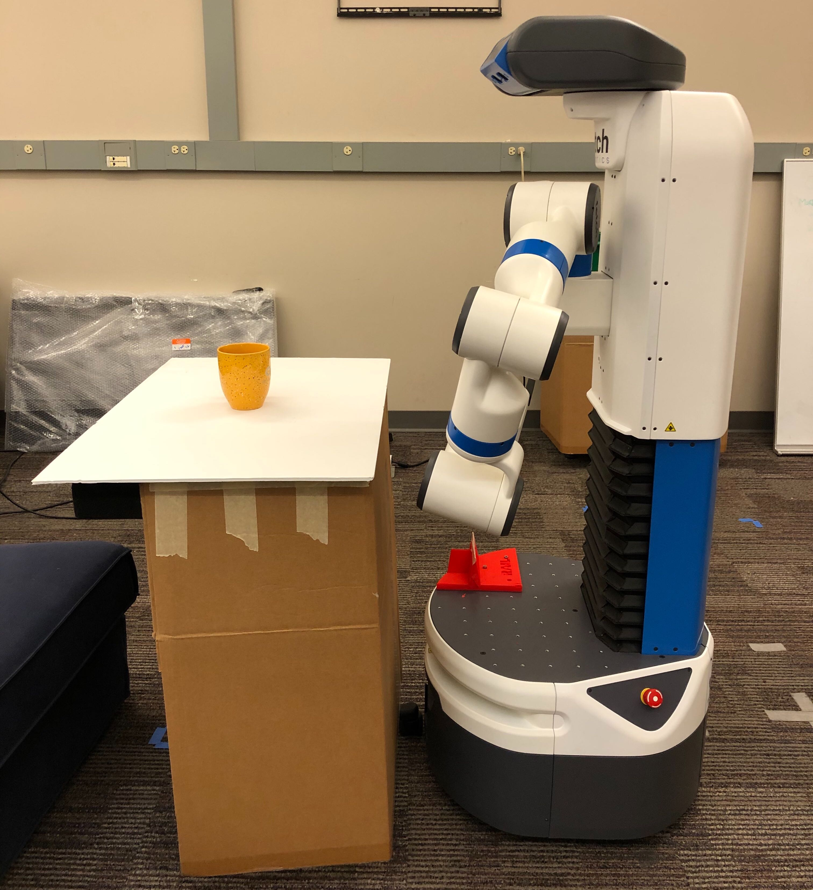

# rail_semantic_grasping
This package contains **Robot** code for the paper ***CAGE: Context-Aware Grasping Engine***. 
Code included here can be used to segment objects based on affordances, sample grasp candidates, and executes semantic grasps on the Fetch robot. 

If you only want to test the ***CAGE*** algorithm on the semantic grasping dataset ***SG14000***, check out the other [repository](https://github.com/wliu88/rail_semantic_grasping).

These two packages maybe will be combined in the future. 

## Collect New Objects for Semantic Grasping
### Note
The AffordanceNet model we use right now is only trained on a small number of object classes, so objects from other classes probably won't be detected and correctly segmented. 

### Setup
The current model is also not very robust to difficult viewing angles and lighting conditions,
so please try to follow the setup shown below.

### Steps
* Start the robot, and park it near the table. 
* Make sure you are receiving messages from Fetch in ros. Check with `rostopic list`
* Modify `/launch/semantic_grasping.launch` if ros topics are different depending on your robot
* Start the server: run `roslaunch rail_semantic_grasping semantic_grasping.launch`
* Start visualization:
    * Run `rviz`
    * Add a `MakerArray` display and set the topic to `/object_semantic_segmentation/markers`
    * Add a `Pose` display and set the topic to `/semantic_grasp_suggestion/grasp`
* Put an object on the table.
* Segment the object based on affordances: 
    * Run `rosservice call /object_semantic_segmentation/segment`
    * Press `Esc` after confirming the 2D segmentation in the window that pops up. 
    * Enter the material of each segmented object part in the terminal that you start the launch. 
    To make the data collection process more efficient, we are manually
    entering the materials for now. Material can also be detected by the robot. 
    * You can run this step how many times you want until you get a desired segmentation 
    (the segmentation is based on AffordanceNet and it doesn't always work perfectly)
* After you get a good segmentation, you can proceed to collect grasp candidates: 
run ` rosservice call /semantic_grasp_suggestion/get_semantic_grasps`. This can take a minute or more. 
* The segmentation along with the grasp candidates for this object is saved to a pickle file. 
Check if it is saved correctly in `/data/unlabeled/YEAR_MONTH_DAY_HOUR_MINUTE/`
* Go back to put another object and repeat segmentation and grasp sampling if needed.
* Now you have all the unlabeled data, check out the other [repo](https://github.com/wliu88/rail_semantic_grasping) to 
understand what's inside each pickle file and see how to collect ground truth labels. 

## Execute Semantic Grasps
Coming up next...
