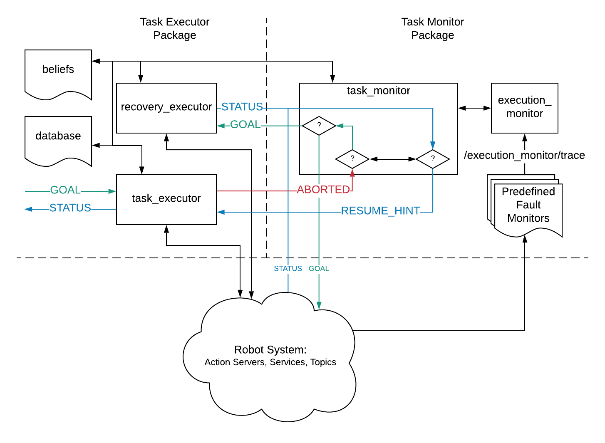

# Task Execution

This folder encapsulates the task execution interface packages that dictate the high level behaviour of the robot. The packages are:

- [`task_execution_msgs`](task_execution_msgs/) - The interface(s) between the task execution and monitoring nodes
- [`task_executor`](task_executor/) - Creates nodes with action clients, service clients, subscribers, publishers, etc. to communicate with the rest of the robot and dictate other nodes to perform the task. Also contains code to sequence the capabilities as necessary.
- [`task_monitor`](task_monitor/) - Creates nodes to monitor the progress of tasks on the task executor. In the event of task failure, the nodes in this package figure out recovery mechanisms.


## Launch

By default, the `task_executor` nodes and the `task_monitor` nodes should startup with the following command:

```bash
roslaunch task_executor fetchit.launch task_executor:=true
```

Each of the packages does have a primary launch file that is invoked by `fetchit.launch`:

- [`task_executor task_executor.launch`](task_executor/launch/task_executor.launch)
- [`task_monitor monitor.launch`](task_monitor/launch/monitor.launch)

Further details can be found in the respective packages.


## Overview

The overall architecture between the packages is shown in the following figure.



At a high level, the flow of control is as follows:

1. Tasks, defined as sequences of robot actions, are assigned to the `task_executor` node using an [`ExecuteActionGoal`](task_execution_msgs/action/Execute.action). The available tasks are generally defined at [`tasks.yaml`](task_executor/config/tasks.yaml)
1. The `task_executor` calls various actions, services, etc. in the robot system to accomplish the task. As part of the execution, there are 2 sources of information that the executor can use to parameterize its actions or the control flow:
    * The `database` node contains known locations and/or joint poses in the environment that can be used as inputs for actions. The entries in the `database` are generally available in [`data.yaml`](task_executor/config/data.yaml)
    * The `beliefs` node is designed to keep track of semantic aspects of the robot or world state through the progress of the task. Beliefs are continuous values between 0 and 1 that can be updated by any node in a non-Bayesian manner by publishing to `/execution_monitor/trace`. The beliefs that are tracked are defined at [`BeliefKeys.msg`](task_execution_msgs/msg/BeliefKeys.msg)
1. If the task succeeds, or is preempted, the `task_executor` returns the corresponding status (`actionlib_msgs/GoalStatus`) and result
1. If the `task_executor` encounters an error, it generates a [`RequestAssistanceActionGoal`](task_execution_msgs/action/RequestAssistance.action) for the `task_monitor` and then awaits a [`RequestAssistanceActionResult`](task_execution_msgs/action/RequestAssistance.action) from it, which contains a `resume_hint` on how to (or not to) proceed with the task
1. When addressing a `RequestAssistanceActionGoal`, the `task_monitor` has the option of executing recovery actions itself. It can do this through the `recovery_executor`, which is simply another instantiation of the `task_executor`
1. In order to decide the recovery strategies to use, the `task_monitor` has access to a trace of tasks that have been completed or the faults that have manifested through the `execution_monitor`
    * The `execution_monitor` logs [`ExecutionEvent`](task_execution_msgs/msg/ExecutionEvent.msg) messages, which are sent out on the topic `/execution_monitor/trace`
    * The `task_executor` publishes the status of each of its actions, as they are completed or not, to `/execution_monitor/trace`
    * Dedicated fault monitors also publish the fault statuses of different components to `/execution_monitor/trace`
    * Since belief updates are also sent out the `/execution_monitor/trace`, the `execution_monitor` contains a log of how the beliefs might change over the course of the task


## API Documentation

The API documentation of the packages in this folder is likely to go out of date very quickly as new functionality is developed. Therefore, we use `sphinx` to automatically generate documentation from docstrings in the source code.

**If you are developing new functionality in `task_executor` or `task_monitor`, please copy the precedent set by existing code in writing docstrings so that the API documentation can remain parse-able**

### Viewing the documentation

1. Make sure you have the necessary `pip` dependencies of `sphinx` installed. They are specified in [`setup_ws.sh`](../scripts/setup_ws.sh)
1. Navigate to [`docs`](docs/) and build the documentation: `make html`
1. Navigate to [`docs/build/html`](docs/build/html) (this folder will be generated by the previous command) and start a simple server: `python -m SimpleHTTPServer`.
1. Navigate to [`http://localhost:8000`](http://localhost:8000) in your browser.

### Adding to the documentation

Since the docs are generated with [`sphinx`](https://www.sphinx-doc.org/en/master/index.html), it's a good idea to get familiar with it, and with reStructuredText, which is format used to specify each page of the documentation (think of the latter as markdown++). Here are some resources:

- [Intro to reStructuredText](https://www.sphinx-doc.org/en/master/usage/restructuredtext/basics.html)
- [Common "commands" for reStructuredText](https://www.sphinx-doc.org/en/master/usage/restructuredtext/directives.html)
- [Python specific "commands"](https://www.sphinx-doc.org/en/master/usage/restructuredtext/domains.html#the-python-domain)
- [reStructuredText cheat sheet](https://github.com/ralsina/rst-cheatsheet/blob/master/rst-cheatsheet.rst)

The most frequent update that is likely to happen to the documentation is with the addition or changes of actions in tasks, so here are the steps that one should follow for that:

1. Create your action file in [`task_executor.actions`](task_executor/src/task_executor/actions/)
1. Define your action `class`, which should derive from [`AbstractStep`](task_executor/src/task_executor/abstract_step.py). Make sure to follow the precedent set by the actions that are already in the code base
1. Add the action's name and `class` to [`__init__.py`](task_executor/src/task_executor/actions/__init__.py)
1. Add the action to the actions documentation page [`task_executor.actions.rst`](docs/source/task_executor.actions.rst). Follow the syntax of other actions that are already in that file.
