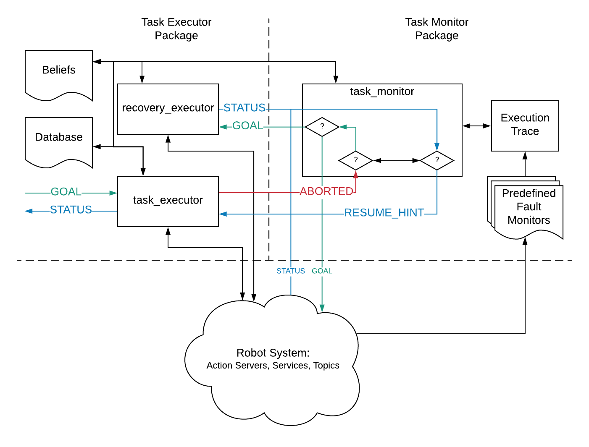

# Task Execution

This folder encapsulates the task execution interface packages that dictate the high level behaviour of the robot. The packages are:

- [`task_execution_msgs`](task_execution_msgs/) - The interface(s) between the task execution and monitoring nodes
- [`task_executor`](task_executor/) - Creates nodes with action clients, service clients, subscribers, publishers, etc. to communicate with the rest of the robot and dictate other nodes to perform the task. Also contains code to sequence the capabilities as necessary.
- [`task_monitor`](task_monitor/) - Creates nodes to monitor the progress of tasks on the task executor. In the event of task failure, the nodes in this package figure out recovery mechanisms.

## Overview

The overall architecture between the packages is shown in the following figure.

